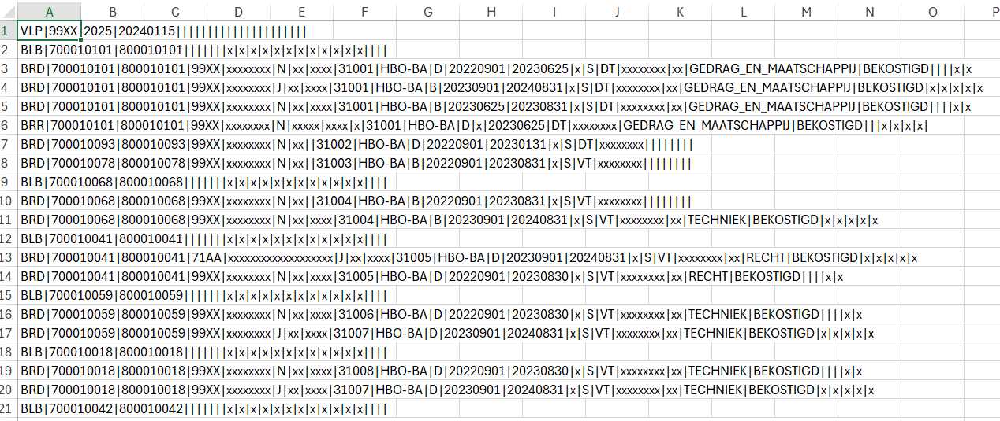

```{r, include = FALSE, echo=FALSE}
knitr::opts_chunk$set(
  collapse = TRUE,
  comment = "#>"
)
```


Each year students start a study programme in institutions of higher education. In the academic year 2023/2024 126059 students started a programme at a university of applied sciences in the Netherlands where they did not study before^[https://www.vereniginghogescholen.nl/kennisbank/feiten-en-cijfers/artikelen/dashboard-instroom-inschrijvingen-en-diploma-s]. These students are not all new in higher education. About 15% of them were previously enrolled in another institution. And of course there are students switching programmes within and between research universities and universities of applied sciences.

With help of the package `wisselstroom` we can gain insight in the flows from and to our own (dutch) institution of higher education. It makes use of the institution specific files relating to the funding of the enrolments, the "bekostigingsbestanden".  

These insights can be used for instance to enhance study information, so that prospective students can make a better informed choice between study programmes.  

This document gives a short introduction to the bekostigingsbestanden, and shows you how to apply the functions from the package `wisselstroom` to these files.    

Note to readers outside of HEI Netherlands: this is very specific to the dutch higher educational system, so probably not relevant outside dutch HE.


# Bekostigingsbestanden  

Official documentation regarding these files can be found at the website of *Dienst Uitvoering Onderwijs (DUO)* of the *Ministerie van Onderwijs en Wetenschappen*: <https://duo.nl/zakelijk/hoger-onderwijs/studentenadministratie/programma-van-eisen-bron-ho.jsp>.  This document also describes how to request the files regarding your HEI.   


## Purpose

A bekostigingsbestand is an analysis file specific for an institution of higher education in the Netherlands that contains funding decisions for all enrolments of that HEI for that funding year. In order to enable the HEI to check the decisions, it also contains information about all other enrolments and degrees obtained of the students involved.  
So not only the enrolments at the own HEI, also enrolments at other HEIs.  

A  bekostigingsbestand can be requested containing information about maximum two years. That implies that we not only are able to gain insight in the programmes they enrolled in *before*, but also *after* enrolment in the programmes of the own HEI. 


## Technical specifications

-  The name of a bekostigingsbestand is relevant information. So do not alter this. The package `wisselstroom` contains an example bekostigingsbestand: "VLPBEK_2025_20240115_99XX.csv". 
    -  VLPBEK tells us it is a voorlopig bekostigingsbestand (a preliminary file). Other options for the first 5 characters are DEFBEK (definitive file) or HISBEK (historical file)
    -  2025 is the year the funding relates to
    -  20240115 is the date the file was created by DUO
    -  99XX is the BRIN of the HEI; BRIN is an abbreviation of BasisRegistratieINstellingen, an administrative code
-  The *size* of a bekostigingsbestand depends on the HEI. For a larger university of applied sciences, and for the maximum time horizon it can be around 15MB (voorlopig bekostigingsbestand).  
-  The file *format* is an UTF-8 coded csv, with a "|" as delimiter. 
-  The file can be considered a container for 5 different sub files with records that are intermingled. Each sub file type has its own interpretation of the columns, so in order to interpret a value in a specific column of the csv, it is needed to also know the recordtype. 

A screenshot of the example bekostigingsbestand:  


```{r out.width = '70%', echo = FALSE}

```


# Working with a bekostigingsbestand


## Reading into a basic `data.frame`

A first step to work with a bekostigingsbestand, is to read it in an R `data.frame`:  

```{r setup}
library(wisselstroom)
```

When reading the data, some checks are made on the filename. So be sure to have the original filename.  

```{r}
# This is the path to the example file.
# To read in your institution specific bekostigingsbestand, 
# change path_to_file accordingly.
path_to_file <- file.path(system.file("extdata", package = 'wisselstroom'),
                           "VLPBEK_2025_20240115_99XX.csv")

# read the data and place it in an R data.frame
my_vlpbek_data <- read_vlpbek_data(path_to_file)
```

## A closer look at the `data.frame`

Have a look at the structure of the read-in example data:  

```{r}
str(my_vlpbek_data)
```

Every row in the csv file becomes a row in the `data.frame`.  The separator in the csv file splits up the row into columns. All `r ncol(my_vlpbek_data)` columns are read in as character. The columns are given a general name (V1, V2, ..., V5), since the content can have a different meaning depending on the sub file type.  In order to gain insight in wisselstromen, we do not need all content of the bekostigingsbestanden. In the example file, this content is x-ed out. 


The first 10 rows and 9 columns:  

```{r}
my_vlpbek_data[1:10,1:9]
```

The first column denotes the sub file type of the row:  

-  the first row and only this row, is a "VLP" (voorlooprecord) with metadata
-  "BLB" records (bekostigingsloopbaan student) are metadata regarding a student's study career in HE 
-  "BRD" records (bekostigingsresultaat deelname), details about a specific enrolment of a student
-  "BRR" records (bekostigingsresultaat resultaat), details about a specific obtained degree of a student
-  the last row and only this row, is a "SLR" (sluitrecord) containing the number of BLB, BRD and BRR rows

This `data.frame` is useful if you want to see what the csv actually contains. For the use of gaining wisselstroom insights, we will not use all columns, nor all sub file types. we only need a part of these data. This is the mext step.

## Making a `vlpbek` object

```{r}
# make the actual my_vlpbek object from the my_vlpbek_data object
my_vlpbek <- vlpbek(my_vlpbek_data)
```

## A closer look at the `vlpbek` object

The `my_vlpbek` object is a list containing `r length(my_vlpbek)` elements:  

-  `brin_own`: the administrative number of the HEI concerned
-  `year_funding`: the financial year in which the funding is disbursed
-  `date_retrieval`: the date the original bekostigingsbestand is made
-  `enrolments`: a `data.frame` containing enrolment data
-  `degrees`: a `data.frame` containing data on obtained degrees


Have a look at the structure of the newly made `my_vlpbek` object:   

```{r}
str(my_vlpbek)
```

Compared to the original dataset, the VLP record is translated to first 3 items. The rows containing the SLR record (totals per record type) and the BLB records (studycareer totals per student) are ignored.  

All the BRD records (enrolment) are placed in its own `enrolment` `data.frame`, as are all the BRR records (degrees) in the `degrees` `data.frame`.  Only the relevant columns for wisselstroom insights are included. A column `academic_year` is added to both `data.frames`, calculated on basis of `date_enrolment` for the `enrolments`, and on `date_graduation` for the `degrees`.  

The column `student_id` is calculated from two original columns in the `my_vlpbek_data`, `V2` and `V3`:   
-  `V2` contains the BSN of the student
-  `V3` contains the onderwijsnummer (educationa number) of the student
-  if `V2` has a value, student_id gets that number , prefixed with a "b", short for BSN
-  if `V2` does not have a value, student_id becomes V3, with prefix "e" for educational number


If you want to address one of the 5 items in the `my_vlpbek` object, you can do that with the `$` operator, for instance: 

-  `my_vlpbek$brin_own` to get a text containing the own brin
-  `my_vlpbek$enrolment` to get a `data.frame` containing the enrolment data

To get some summary insights, we can make a `compact_vlpbek` object 

## Making a `compact_vlpbek` object 

```{r}
# make the actual my_vlpbek_compact object from the my_vlpbek object
my_vlpbek_compact <- compact_vlpbek(my_vlpbek)
```

## A closer look at the `compact_vlpbek` object 

The `my_vlpbek_compact` object is a list containing `r length(my_vlpbek_compact)` elements:  

-  `brin_own`: the administrative number of the HEI concerned
-  `enrolments_degrees_compact`: a `data.frame` with compact enrolment data, adorned with degree data if applicable 
-  `presences_brin`: a `data.frame` with summary data per student regarding enrolment in brins
-  `presences_level`: a `data.frame` with summary data per student regarding enrolment in levels
-  `switches`: a `data.frame` containing data on switches (from a program without a degree to another program)
-  `summary_presences_brin`: presences_brin per academic year summarised over students
-  `summary_presences_level`: presences_level per academic year summarised over students

Have a look at the structure of the newly made `my_vlpbek` object:   

```{r}
str(my_vlpbek)
```


